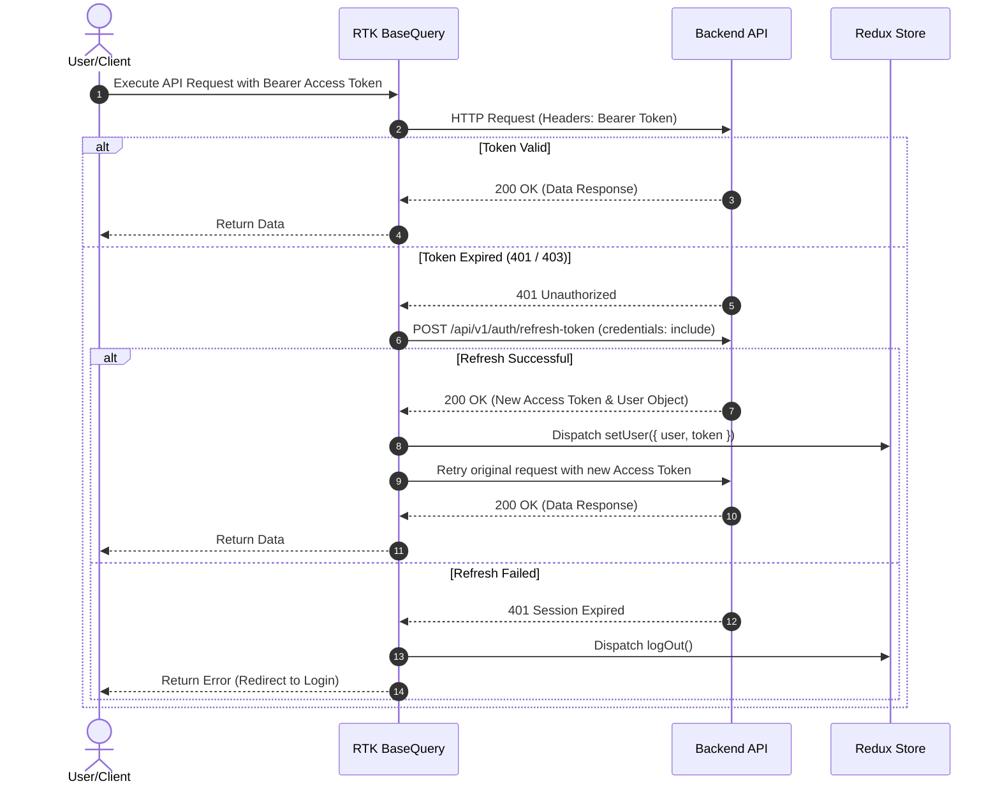

# 🛒 Bazar Hisab (bazarhisab.com) - Next.js 16 Web Application & Admin Portal

[](https://nextjs.org/)
[](https://react.dev/)
[](https://redux-toolkit.js.org/)
[](https://tailwindcss.com/)
[](https://www.typescriptlang.org/)
[](LICENSE)

**Bazar Hisab** is a complete, modern web application and administration platform designed for managing household and mess shopping expenses (*bazar*), shared utility bills, product pricing growth analytics, group memberships, and user feedback.

The application serves dual purposes:
1. **User Web App Shell (`/web`, `/app`)**: Mobile-first responsive web client allowing users to manage daily bazaar entries, record batch/single expenses, calculate bill shares, manage mess groups, edit profile settings, and view notification feeds.
2. **Admin & Analytics Dashboard (`/dashboard`)**: Powerful management portal for system administrators to view monthly financial analytics, user activity trends, product price growth graphs (e.g., tracking inflation on daily essentials like Rice, Oil, Onion), manage user accounts, oversee groups, review system activity logs, handle contact inquiries, and configure app policies dynamically via rich-text editors.

---

## 📋 Table of Contents

- [✨ Key Features](#-key-features)
  - [📱 User Web Portal (`/web`)](#-user-web-portal-web)
  - [🛡️ Admin Dashboard (`/dashboard`)](#️-admin-dashboard-dashboard)
- [💻 Technical Architecture](#-technical-architecture)
  - [Redux Toolkit & RTK Query Architecture](#redux-toolkit--rtk-query-architecture)
  - [Authentication & Auto Token Refresh Flow](#authentication--auto-token-refresh-flow)
- [📁 Detailed Directory Structure](#-detailed-directory-structure)
- [📦 Environment & Configuration](#-environment--configuration)
- [🚀 Quick Start & Installation](#-quick-start--installation)
- [📜 Available NPM Scripts](#-available-npm-scripts)
- [🔌 API Endpoints Summary](#-api-endpoints-summary)
- [📄 License & Author](#-license--author)

---

## ✨ Key Features

### 📱 User Web Portal (`/web`)

- **Bazar & Expense Tracker**:
  - **Single & Batch Entry**: Add individual expenses or bulk-add multiple bazaar entries at once with itemized costs, quantities, units, and custom notes.
  - **Product Auto-complete & Catalog**: Select items from the central product catalog (with 18+ content filters and image previews).
  - **Expense History**: Filter and review personal and group bazaar entries with date ranges and buyer details.

- **Utility Bills & Mess Calculation**:
  - **Bill Splitter**: Record utility bills (Electricity, Gas, Water, Internet, Maid salary, Rent) and automatically calculate individual shares among mess members.
  - **Single & Batch Bill Creation**: Support for single or multi-bill entries.

- **Group & Mess Governance**:
  - **Group Switcher & Picker**: Seamlessly switch between multiple active mess/household groups.
  - **Member Management**: View member lists, manager roles, and member-wise contribution totals.

- **Account & Personalization**:
  - **Profile & Password Management**: Update personal info, profile picture (Cloudinary integration), and credentials.
  - **Notification Center**: Real-time notifications for expense additions, group invitations, and announcements.

---

### 🛡️ Admin Dashboard (`/dashboard`)

- **📊 Comprehensive Analytics**:
  - **Monthly Analysis Charts**: Visualize total bazaar spending, bill distribution, active user growth, and group velocity over customizable date ranges.
  - **Product Price Growth Tracker**: Dedicated charts tracking historical price changes per product unit over time (helping analyze inflation trends).

- **👥 User & Group Management**:
  - **User Directory**: View registered users, account creation dates, role badges (Admin / User), verification status, and block/unblock controls.
  - **Group Directory**: Overview of created groups, total members, total expenses logged, and group admins.

- **🛍️ Master Catalog & Expenses Control**:
  - **Product Catalog Management**: Create, edit, activate/deactivate products, mark 18+ age restrictions, and manage item photo uploads via Cloudinary.
  - **All Expenses & Bills Audit**: Admin-level table to inspect, edit, or delete any bazaar entry or bill across the platform.

- **🔍 Security & Activity Monitoring**:
  - **Activity Logs**: Full audit trail of user actions, API events, role changes, and system errors.
  - **Visitor Traffic**: Track visitor IP addresses, user agents, landing pages, and access timestamps.

- **📢 Support & CMS**:
  - **Contact & Inquiries**: Admin inbox to review messages submitted through the website contact form and mark them as resolved/in-progress.
  - **App Reviews & Ratings**: View public app reviews, average rating stars, and feedback comments.
  - **Dynamic Legal CMS**: Edit Privacy Policy, Terms & Conditions, and FAQs directly from the dashboard using the integrated **Jodit Rich Text Editor**.

---

## 💻 Technical Architecture

### Redux Toolkit & RTK Query Architecture

State management is powered by **Redux Toolkit** and **RTK Query** with local storage persistence via `redux-persist`.

```text
redux/
├── store.ts               # Configures Redux store with auth slice persistence
├── hooks.ts               # Typed hooks: useAppDispatch, useAppSelector
├── api/
│   └── baseApi.ts         # Central RTK Query API slice with auto-reauth middleware
└── features/              # Feature API slices injecting endpoints into baseApi
    ├── activity/          # activityApi.ts
    ├── auth/              # authApi.ts, authSlice.ts
    ├── bazar-entry/       # bazarEntryApi.ts
    ├── bill/              # billApi.ts
    ├── contact/           # contactApi.ts
    ├── dashboard/         # dashboardApi.ts
    ├── faq/               # faqApi.ts
    ├── feedback/          # feedbackApi.ts
    ├── group/             # groupApi.ts
    ├── notification/      # notificationApi.ts
    ├── policy/            # policyApi.ts
    ├── product/           # productApi.ts
    ├── review/            # reviewApi.ts
    ├── user/              # userApi.ts
    └── visitor/           # visitorApi.ts
```

### Authentication & Auto Token Refresh Flow

The app implements a resilient JWT authentication pattern using Redux middleware:



---

## 📁 Detailed Directory Structure

```text
mybazarhisab-frontend-web/
├── app/                              # Next.js App Router Structure
│   ├── (auth)/                       # Authentication routing group
│   │   ├── login/                    # Login page
│   │   ├── register/                 # User registration page
│   │   ├── forgot-password/          # Password reset request
│   │   └── reset-password/           # New password entry
│   ├── dashboard/                    # Admin Dashboard routes
│   │   ├── page.tsx                  # Dashboard main stats overview
│   │   ├── activities/               # System activity audit logs
│   │   ├── bills/                    # Utility bills audit
│   │   ├── contacts/                 # Customer inquiry inbox
│   │   ├── expenses/                 # Master expenses table
│   │   ├── members/                  # Group members overview
│   │   ├── policies/                 # Privacy & Terms WYSIWYG editor
│   │   ├── products/                 # Product catalog & price growth graphs
│   │   ├── reviews/                  # Customer reviews & ratings
│   │   ├── settings/                 # Global app settings
│   │   ├── users/                    # User accounts management
│   │   └── visitors/                 # Visitor analytics
│   ├── web/                          # User Web Application Shell
│   ├── contact/                      # Public Contact Us page
│   ├── feedback/                     # Public Feedback page
│   ├── privacy-policy/               # Public Privacy Policy page
│   ├── terms-and-conditions/         # Public Terms & Conditions page
│   ├── globals.css                   # Tailwind v4 configuration & base styles
│   ├── layout.tsx                    # Root layout with providers & fonts
│   ├── page.tsx                      # Main landing page redirect / hero
│   └── not-found.tsx                 # 404 Error page
├── components/                       # Reusable Component Architecture
│   ├── app/                          # Web app embedded views & screens
│   │   ├── screens/                  # AddExpense, AddBill, Profile, Groups screens
│   │   ├── tabs/                     # Home, Expenses, Bills, Profile tabs
│   │   └── ui/                       # Common mobile-styled UI elements
│   ├── dashboard/                    # Admin UI components
│   │   ├── AdminMonthlyAnalysisChart.tsx # Financial & trend charts
│   │   ├── DashboardHeader.tsx       # Header with user profile & notifications
│   │   ├── DashboardSidebar.tsx      # Navigation sidebar for admin routes
│   │   ├── ImageUpload.tsx           # Cloudinary image uploader component
│   │   └── StatCard.tsx              # Analytics key figure card
│   ├── providers/                    # Context Providers
│   │   ├── ReduxProvider.tsx         # Redux & Redux Persist Provider
│   │   └── ToasterProvider.tsx       # Sonner toast container
│   └── web/                          # Marketing & public web components
├── lib/                              # Helper functions & utility methods
├── redux/                            # Redux state management (slices & API)
├── public/                           # Static image assets, icons, logos
├── .env                              # Environment variables (git-ignored)
├── .env.example                      # Environment template file
├── eslint.config.mjs                 # ESLint v9 configuration
├── next.config.ts                    # Next.js 16 setup & image domain permissions
├── postcss.config.mjs                # PostCSS setup with @tailwindcss/postcss
├── package.json                      # Project metadata & npm dependencies
└── tsconfig.json                     # TypeScript compiler configuration
```

---

## 📦 Environment & Configuration

Create a `.env` file in the root directory by copying `.env.example`:

```bash
cp .env.example .env
```

Set the required environment variables:

```env
# Backend REST API URL
NEXT_PUBLIC_API_URL=http://localhost:5065

# Cloudinary Storage Configuration (For uploading product & profile photos)
NEXT_PUBLIC_CLOUDINARY_CLOUD_NAME=j5va5yg1
NEXT_PUBLIC_CLOUDINARY_UPLOAD_PRESET=Mybazarhisab-App
```

---

## 🚀 Quick Start & Installation

### Prerequisites
- **Node.js**: `v18.17.0` or higher (Node.js `v20.x` recommended)
- **Package Manager**: `npm`, `yarn`, `pnpm`, or `bun`
- **Backend API**: Running instance of `mybazarhisab-backend`

### Step-by-Step Installation

1. **Clone the repository**:
   ```bash
   git clone https://github.com/your-username/mybazarhisab-frontend-web.git
   cd mybazarhisab-frontend-web
   ```

2. **Install project dependencies**:
   ```bash
   npm install
   ```

3. **Configure environment variables**:
   Set up your local `.env` file as shown in the [Environment & Configuration](#-environment--configuration) section.

4. **Launch the development server**:
   ```bash
   npm run dev
   ```

5. **Open in Browser**:
   Navigate to [http://localhost:3000](http://localhost:3000) to access the application.

---

## 📜 Available NPM Scripts

| Script | Command | Description |
| :--- | :--- | :--- |
| `dev` | `next dev` | Starts the Next.js development server on port `3000` with hot reloading. |
| `build` | `next build` | Compiles and optimizes the app for production deployment. |
| `start` | `next start` | Starts the production server using the built `.next` bundle. |
| `lint` | `eslint` | Runs ESLint checks across TypeScript and React codebases. |

---

## 🔌 API Endpoints Summary

The web application interacts with the **Bazar Hisab API v1** (`/api/v1/`). Key tags and endpoint routes defined in RTK Query include:

| Tag | Main Endpoints | Purpose |
| :--- | :--- | :--- |
| **Auth** | `/auth/login`, `/auth/refresh-token`, `/auth/forgot-password` | User authentication, token management, session handling. |
| **BazarEntry** | `/bazar-entries`, `/bazar-entries/products` | Daily bazaar shopping list entries and itemized costs. |
| **Bill** | `/bills`, `/bills/stats` | Utility bill creation, status updates, and monthly breakdowns. |
| **Product** | `/dashboard/product-price-growth/:id`, `/products` | Master product catalog and price fluctuation trend analysis. |
| **Dashboard** | `/dashboard/stats`, `/dashboard/monthly-analysis` | Admin analytics, monthly financial metrics, overall system counts. |
| **Group** | `/groups`, `/groups/:id/members` | Mess & household group management and member allocations. |
| **User** | `/users`, `/users/block-status` | User profile updates, administration, user blocking. |
| **Policy** | `/policies`, `/policies/:type` | WYSIWYG legal text management (Terms, Privacy Policy, FAQs). |
| **Contact** | `/contacts`, `/contacts/reply` | Public inquiry form submission and admin response management. |

---

## 📄 License & Author

This repository is maintained for **Bazar Hisab**. Distributed under the **MIT License**. See [LICENSE](LICENSE) for more details.
